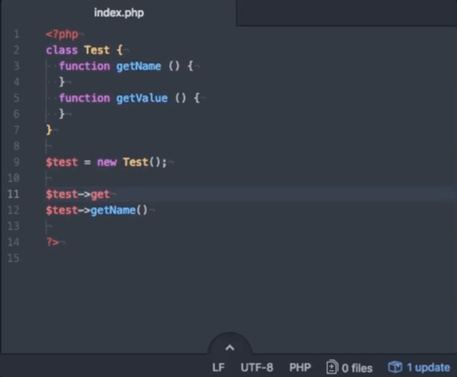

# eclim-atom-autocomplete-provider package

## Description

This plugin allows to add an autocomplete engine to Atom from Eclipse (for more details [see](http://eclim.org)).

## Installation

1. Install Eclipse + Eclim [See](http://eclim.org/install.html)
2. Activate this plugin: run `npm i && apm i && apm link` in plugin directory

## License

MIT, Copyright (c) 2017–ω ksv
